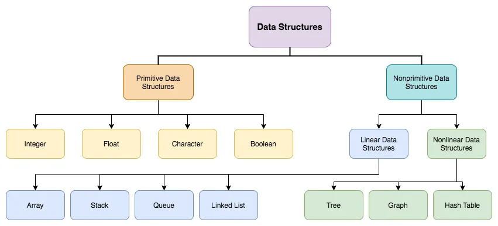

This is where all the Algorithms, Data Structures and LeetCode will live.

Concepts I want to really nail

Value vs Reference Type
Heap and Stack

Arrays
Array Operations
Multidimensional
Nested arrays

Lists

Make sure these are really nailed in terms of complexity, operations and techniques for manipulating each.

Algorithm solving techniques
Two Pointer
Sliding Window

Recursion
Brute Force
Dynamic Programming
